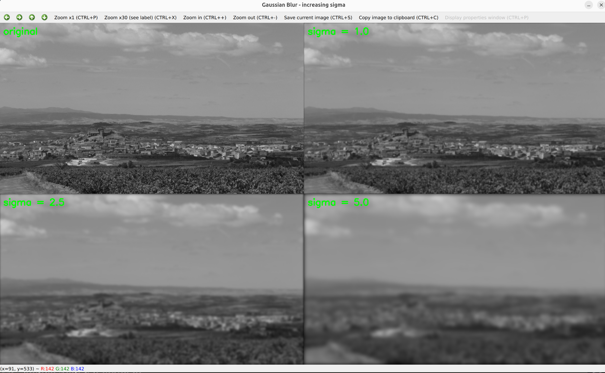

# Gaussian Blur Filter
Mathematically the same as convolving the image with a Gaussian function.
$$G(x, y) = G(x) \cdot G(y) = \frac{1}{2\pi\sigma^2}\exp{-\frac{x^2 + y^2}{2\sigma^2}}$$

Each pixel's new value is set to a weighted average of the neigboring pixels (weigthed by the Gaussian distribution)



## Implementation
Gaussian filter is **separable** meaning that it can be computed as a sequence of operations first in one dimension and then 
in the second (for 2d images). The implication of this are direct to our usecase of parallelizing on a GPU and also observable on 
the big O complexity analysis. Given a kernel of size $h_k  \times w_k$ the complexity:
1. Separable filter: $\mathcal{O}(w_k \cdot w_{img} \cdot h_{img}) + \mathcal{O}(h_k \cdot w_{img} \cdot h_{img})$
1. Non-Separable filter: $\mathcal{O}(w_k \cdot  h_k \cdot w_{img} \cdot h_{img})$

For simplicity reasons, this first Implementation will use a square kernel $k\times k$

## CUDA
### Optimization
The naive approach, reimplement the CPU algorithm, assign each thread to a pixel and compute its kernel accumulation first for every pixel
on the horizontal pass and then for every pixel in the vertical pass is quite inefficient

#### Fix memory acces: Coalescing
Threads access to global memory must be efficient. For the horizontal pass:
```text
thread:
   0    1    2    3    4    5    6    7 ...
   │    │    │    │    │    │    │
   ▼    ▼    ▼    ▼    ▼    ▼    ▼
pixel  pixel pixel pixel pixel pixel pixel
 100    101  102  103  104  105  106
```
and 
```text
Thread 0 → src[row][100]
Thread 1 → src[row][101]
Thread 2 → src[row][102]
Thread 3 → src[row][103]
...
```
Threads from the same block are accessing neigboring pixels (ideally from the same row) that is already in cache -> **coalesced memory access**

#### Constant memory
kernel is small and read-only by all threads, ideal usecase for CUDA constant memory, currently is allocated in global memory `cudaMalloc`, the change is to
create a CUDA constant-memory array `__constant__ float c_kernel[MAX_KERNEL_SIZE]`

```text
Experiment Sigma: 2 kernel-size: 13
Avg. Duration CPU approach: 1579.83 microseconds / iteration
Avg. Duration GPU approach: 4445.18 microseconds / iteration # slighly faster than the kernel float optimization
```
#### Shared Memory: Tiling
Convolution is really overlapped heavy, for every pixel we load neighboring pixels (depending on kernel size), hence the same pixel gets loaded again and again
from neighboring threads:
```text
kernel = [x x x x x x x]
           ← radius 3 →

Thread 0 needs: 0 1 2 3 4 5 6
Thread 1 needs:   1 2 3 4 5 6 7
Thread 2 needs:     2 3 4 5 6 7 8
Thread 3 needs:       3 4 5 6 7 8 9
```
Assuming you've done your work and memory access is coalesced your block of threads need data from the same memory region. What we want now is, instead of having each thread
independently fetching its neighbors from global memory, we load the whole region into **shared memory** just once for the whole grid-block.
Conceptually: 
```text
pixel A
  │        gets loaded once 
  ▼
shared memory
  │
  │               it is accessible by all threads in the block, reducing global-memory trafic
  │
  ├── thread 0
  ├── thread 1
  ├── thread 2
  └── ...
```


## Comments
OpenCV gaussian is really optimized even for CPU, separable convolution, SIMD, cache friendly vertical axis convolution (most likely they
transpose the image on the second pass), etc.

- First Implementation of the CUDA approach is still worst than OpenCV CPU approach:
```text
Experiment Sigma: 2 kernel-size: 13
Avg. Duration CPU approach: 1503.97 microseconds / iteration
Avg. Duration GPU approach: 5383.57 microseconds / iteration
Btw: we can optimize even further just by moving to using kernel in float and not double precision:
(float kernel)Avg. Duration GPU approach: 4577.15 microseconds / iteration
```

| Data              | Access pattern                     | Appropriate memory  |
| ----------------- | ---------------------------------- | ------------------- |
| Image             | each thread reads different pixels | Global memory       |
| Gaussian kernel   | every thread reads same values     | **Constant memory** |
| Neighborhood/tile | many threads reuse same pixels     | Shared memory       |
| Output            | each thread writes one pixel       | Global memory       |


# References
- https://en.wikipedia.org/wiki/Gaussian_blur
