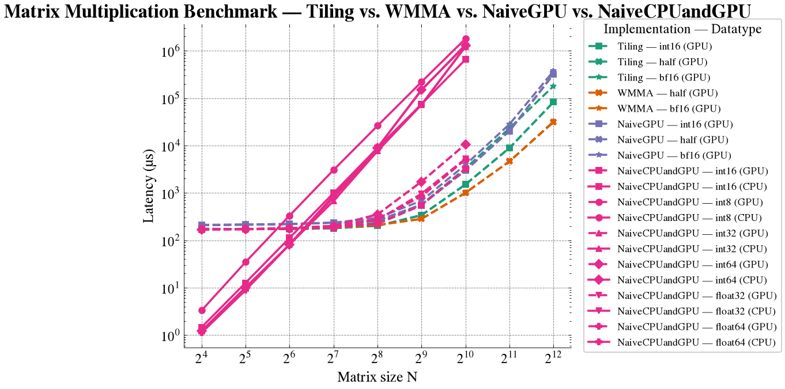
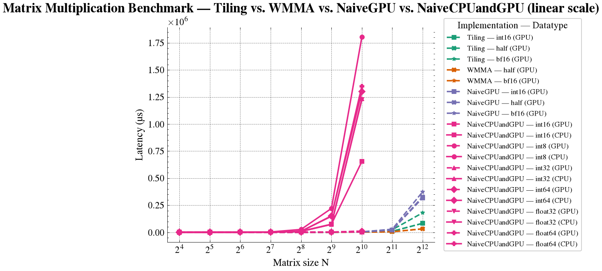
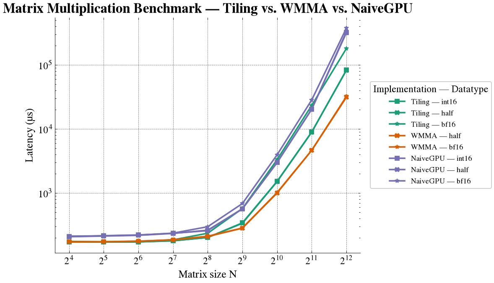
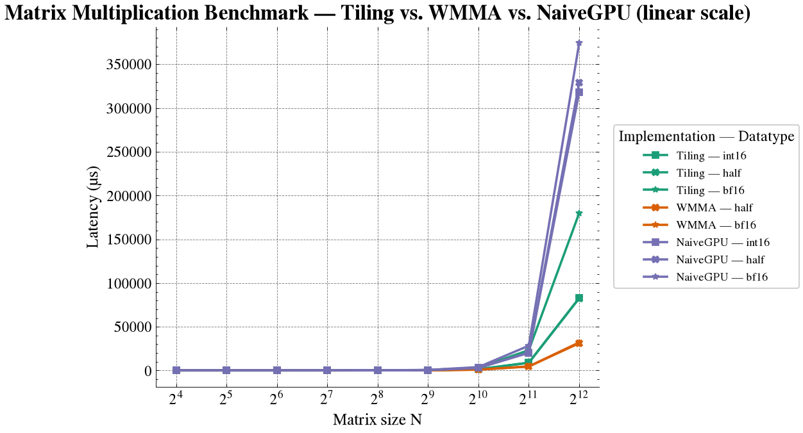
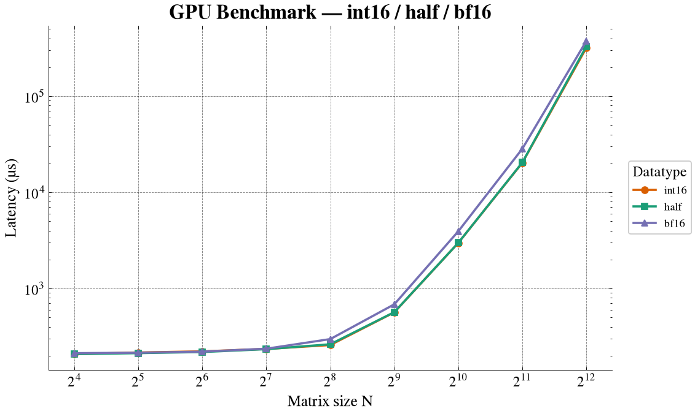
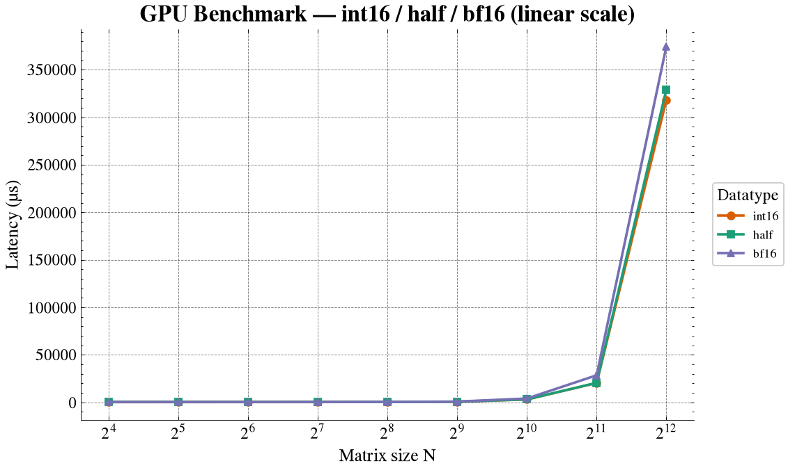
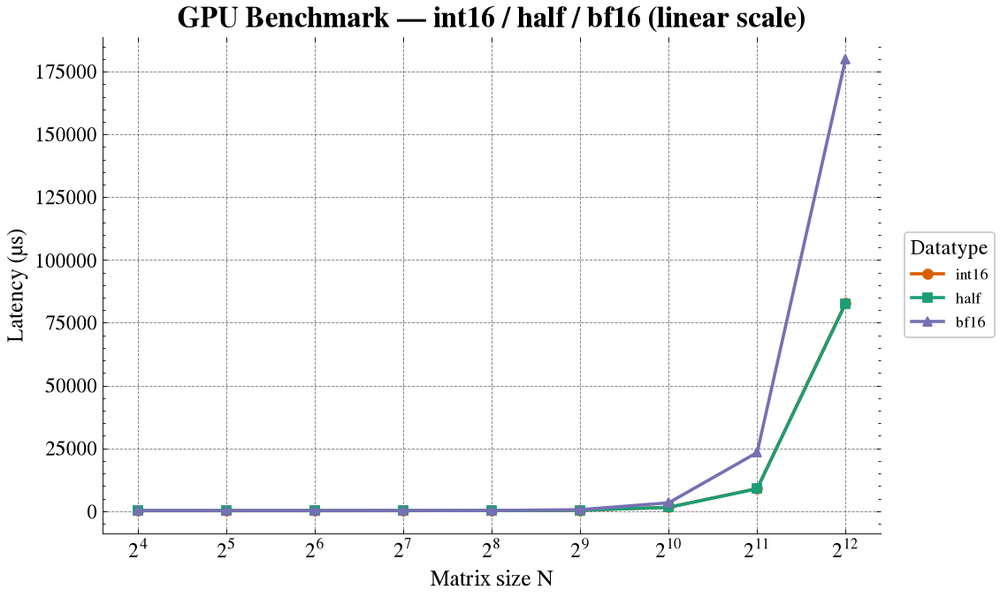
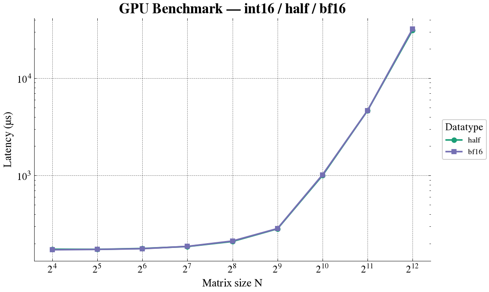
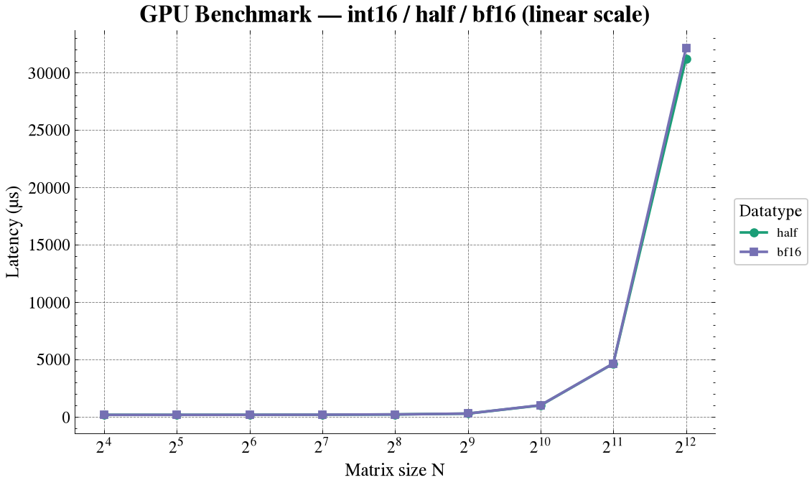

# Matrix Multiplication

C++ and CUDA implementations and optimization experiments.

## Main Results (spoiler)

### Full comparison

All approaches all datatypes and CPU-GPU implementaitons, there are clearly to phases, for small matrices GPU overhead cannot match CPU direct speed.

<p float="left">
    
    
</p>

### GPU optimziations

clear winner: tensor cores
second: tiling

<p float="left">
    
    
</p>

## Main Problem of Matrix Multiplication via Naive Implementation

Once each thread is assigned a target `dst` (row, col), it has to perform an accumulation over the multiplication of the corresponding row and column elements of matrices `a` and `b` (as given by the equation).

This accumulation on the GPU basically retrieves elements from global memory, `d_a[]` and `d_b[]` (in float precision, 4 bytes), and writes another number to the result element `d_dst[]`. So, there are two operations, `*` and `+`, for 8 bytes retrieved and another 4 bytes written afterward.

This is really inefficient and bandwidth-bound for small-size matrices.

## Naive Implementation

### CPU vs GPU

Naive implementation results averaged across 100 iterations, measuring end-to-end latency. As shown in the first image below, we distinguish the two expected regimes:

1. **Memory-bound**
2. **Compute-bound**

For matrix sizes smaller than `128×128`, the GPU-added overhead (memory allocation via `cudaMalloc` and memory retrieval in parallel by the threads when computing the multiplication) dominates. Even with thousands of threads running in parallel, the CPU single-threaded implementation is still faster.


### GPU Only

The following figure shows how the end-to-end latency is fixed and stable for matrix sizes up to `256×256` and for all data types.

What does this mean? The overhead of preparing the GPU and launching the kernel dominates the execution time. Thus, having more elements in this regime does not make a difference.

It is only for matrices larger than `512×512` that we start to see the exponential growth of the actual arithmetic work (due to having more elements).


Fastest datatypes? `int16` in the compute-bound regime and `int8` in the memory-overhead regime (makes sense). In the compute-bound regime, the most interesting, `int16` is followed by `int8`, `float32`, and `int32`.

| Size    |     16 |     32 |     64 |    128 |    256 |     512 |    1024 |
| ------- | -----: | -----: | -----: | -----: | -----: | ------: | ------: |
| float32 | 173.97 | 172.19 | 175.61 | 195.93 | 267.76 |  960.47 | 5245.05 |
| float64 | 168.87 | 172.26 | 180.37 | 202.82 | 352.94 | 1734.14 | 10638.4 |
| int16   | **168.59** | 171 | 180.14 | 188.72 | **221.55** | **546.78** | **3225.88** |
| int32   | 172.55 | 171.31 | 176.08 | 195.88 | 268.35 | 963.03 | 5234.65 |
| int64   | 169.61 | 172.52 | 179.75 | 201.63 | 351.36 | 1730.39 | 10676.1 |
| int8    | 170.25 | **170.51** | **175.26** | **185.01** | 279.51 | 845.56 | 5077.68 |

### GPU Only: `i16`, `fp16`, and `bf16`

Currently, three of the most important datatypes in machine learning. `bf16` introduces some overhead over the other types. This has to do with their fundamental definitions:

- **fp16:** one sign bit, five exponent bits, and ten mantissa bits (represents numbers with roughly three to four decimal digits of precision).
- **bf16:** one sign bit, eight exponent bits, and seven mantissa bits (represents a wider range of numbers, but decimal precision gets reduced to two to three digits).

It is clear that `bf16` sacrifices precision for a broader exponent range.

In this experiment, we see similar performance, but the architecture favors `fp16`.

<p float="left">
    
    
</p>

## Matrix Multiplication Optimization

Accelerate the data traffic without affecting the number of math operations.

### Math-Bound vs. Memory-Bound Operations

An operation performed on a piece of hardware can be either math-bound or memory-bound.

- **Math bandwidth:** the rate at which math-unit operations can be conducted by the processor, `operations/second` (OPS). If we are working with the `float` datatype, then the most common name is FLOPS. My NVIDIA DGX shows off ≈100 TFLOPS, i.e. `10^12` FLOPS.
- **Memory bandwidth:** the rate at which data can be read from or stored into semiconductor memory by a processor, `bytes/second`. Again, the NVIDIA DGX has 273 GBytes/s.
- **Data reuse:** cache is smaller, faster memory closer to the processor core. Data reuse is just the idea of copying the data you are going to be using a lot to cache.

Matrix multiplication requires `2*N^3` math operations (addition and multiplication) in the naive approach.

If we are using a data precision of `b` bits, then the amount of data read is `2b*N^3`. Let's say in the cache memory we can store a whole `N×N` matrix and one array of `N` elements. Then we can reduce the amount of data reads to `N×N + N×N` (moving the first matrix to cache and then reading and moving array by array the next matrix to cache), and for `b` bits, `2bN^2`.

In terms of writing to memory, we just write the output matrix, `bN^2`, so data-transfer-wise there will be `3bN^2`.

#### Definitions

Time it takes in terms of operations:

$$
t_{math} = \frac{N_{op}}{BW_{math}}
$$

Time it takes in terms of memory operations:

$$
t_{mem} = \frac{N_{byte}}{BW_{mem}}
$$

Hence, we can see which dominates the total time:

- **Math-bound**

$$
\frac{N_{op}}{N_{byte}} > \frac{BW_{math}}{BW_{mem}}
$$

- **Memory-bound**

$$
\frac{N_{op}}{N_{byte}} \lt \frac{BW_{math}}{BW_{mem}}
$$

Using the right terminology, `N_op/N_byte` is referred to as the **arithmetic intensity**.

### Optimizing

`N_op` is usually a constant unless you know better algorithms, but we can try to minimize `N_bytes` as much as possible by reusing data. If an operation is memory-bound, then the computer system is under-utilized.

- **Matrix multiplication case:** for this case, the arithmetic intensity becomes

$$
\frac{N_{op}}{N_{byte}} = \frac{2N^3}{2bN^3 / 8} = \frac{8}{b} \; \text{OP/byte}
$$

And in the case of data reuse (as described above):

$$
\frac{N_{op}}{N_{byte}} = \frac{2N^3}{3bN^2 / 8} = \frac{16N}{3b} \; \text{OP/byte}
$$

For my NVIDIA DGX Spark:

$$
\frac{BW_{math}}{BW_{mem}} = \frac{10^{12} FLOPS}{273 \cdot 10^9 B/s} = 3.663 \; \text{OP/byte}
$$

Arithmetic intensity under this threshold means the operation is considered memory-bound.

As these specifications of the DGX Spark are for `fp16` (rn I'm not sure they managed to offuscate official grace balckwell datasheet for nvidia dgx...):

$$
\frac{N_{op}}{N_{byte}} = \frac{16N}{3b} = \frac{N}{3} \; \text{OP/byte}
$$

So if:

$$
N \lt 3 \cdot 3.663 \approx 10
$$

the multiplication operation is memory-bound.

### Math-bound Matrix Multiplication
In our work we usually deal either with Nvidia dgx spark or Nvidia A40 for each of them the arithmetic intensity given mixed precision bf16 and fp32 accumulate
no data-reuse yet:
$$
\frac{N_{op}}{N_{byte}} = \frac{8}{b} = \frac{1}{4} \; \text{OP/byte}
$$
- [NVIDIA A40](https://images.nvidia.com/content/Solutions/data-center/a40/nvidia-a40-datasheet.pdf): $\frac{BW_{math}}{BW_{mem}} = \frac{149.7 \cdot 10^12 FLOPS}{696 \cdot 10^9 Bytes/s} = 215$
- [NVIDIA DGX Spark](https://www.aspsys.com/wp-content/uploads/2025/05/nvidia-dgx-spark-datasheet.pdf): $\frac{BW_{math}}{BW_{mem}} = \frac{10^12 FLOPS}{273 \cdot 10^9 Bytes/s} = 10$

In both cases the naive implementation is memory bound (0.25 less than the arithmetic instensity). We saw before that caching and data reuse was a great option but of course cache size is **limited** and GEMM is supposed to work for all matrix sizes. 
> Idea: Cache both matrix A and B operands into cache via matrix multiplication decomposition

#### Matrix Multiplication Decomposition
- Number of operations remains the same: $2N^3$
- But smaller matrices can be cached, being $d$ the size of the smaller matrix patch, $N_{bytes} = (N^3 / d^3) \cdot 2 \cdot b \cdot d^2$ again recall 2 because we read from the 2 operands, b bits size of the data type and $d^2$ the number of digits in the patch we read from cache, all that times the amount of patches we have divided our matrix into. $N_{bytes} = 2bN^3 / d$ for fp32: $N_{bytes} = 8N^3 /d$ 

$$
\frac{N_{op}}{N_{byte}} = \frac{d}{4} \; \text{OP/byte}
$$

aha! the math intensity can be increased in terms of d until you fill up your cache size!
- nvidia a40: $d \gt 830$ to have it purely math bound
- nvidia dgx spark: $d \gt 40$ to have it purely math bound

### Implementation
if the naive implementation is $c_{i, j} = \sum_{k=0}^{N} a_{i, k} * b_{k, j}$
the cache friendly (tile based) matrix decomposition into d patches is just 
$$
c_{i, j} = \sum_{p=0}^{N/d} \( \sum_{k=0}^{d} a_{i, k} * b_{k, j} \)
$$

### Tiled (Shared-Memory) vs Naive GPU MatMul — BLOCK_DIM = 16
<p float="left">
    
    
</p>

| Metric              |      16 |      32 |      64 |     128 |     256 |     512 |    1024 |     2048 |      4096 |
|----------------------|--------:|--------:|--------:|--------:|--------:|--------:|--------:|---------:|----------:|
| int16 — naive        |  207.92 |  216.01 |  221.71 |  235.17 |  258.25 |  565.30 | 2980.73 | 20283.70 | 318068.00 |
| int16 — tiled        | **172.64** | **171.46** | **172.64** | **179.70** | **202.44** | **342.11** | **1518.97** | **8961.23** | **82895.90** |
| int16 — speedup (x)  |    1.20 |    1.26 |    1.28 |    1.31 |    1.28 |    1.65 |    1.96 |     2.26 |      3.84 |
| half — naive         |  207.61 |  212.67 |  218.43 |  233.87 |  262.97 |  567.56 | 2985.75 | 20420.50 | 329044.00 |
| half — tiled         | **173.65** | **172.46** | **172.39** | **179.41** | **202.17** | **336.45** | **1502.97** | **8903.70** | **82562.90** |
| half — speedup (x)   |    1.20 |    1.23 |    1.27 |    1.30 |    1.30 |    1.69 |    1.99 |     2.29 |      3.99 |
| bf16 — naive         |  212.48 |  214.63 |  220.40 |  236.38 |  297.74 |  684.56 | 3935.87 | 28373.50 | 374303.00 |
| bf16 — tiled         | **175.82** | **172.40** | **174.19** | **185.91** | **235.55** | **571.56** | **3309.44** | **23329.50** | **179932.00** |
| bf16 — speedup (x)   |    1.21 |    1.24 |    1.26 |    1.27 |    1.26 |    1.20 |    1.19 |     1.22 |      2.08 |

- Speedup = naive_latency / tiled_latency. Values > 1.0 mean the tiled kernel is faster.
- Tiled kernel wins at every size and datatype tested; the margin grows sharply once matrices exceed 512 (memory-bound naive kernel suffers far more from repeated global loads as N grows).
- int16 and half track each other closely at every size (same element width, similar coalescing behavior) — speedup curves are almost identical.
- bf16 tracks int16/half closely up to size 256, then diverges: from 512 onward its speedup shrinks (1.20x -> 1.19x at 512/1024) before recovering to 2.08x at 4096. This suggests bf16 arithmetic/conversion overhead (or MMA path differences) dominates over the shared-memory reuse benefit in that mid-range, unlike int16/half where the tiled kernel's advantage keeps compounding with size.
- Largest win: int16 and half at size 4096, ~3.8-4.0x faster tiled vs naive.
- Smallest win: bf16 at size 1024, only ~1.19x — worth investigating whether the bf16 path is bottlenecked elsewhere (e.g. conversion cost, bank conflicts, or occupancy) rather than benefiting fully from the tiling optimization at that size.


## Tensor Cores and Matrix Multiplication

- https://leimao.github.io/blog/NVIDIA-Tensor-Core-Programming/
- https://leimao.github.io/blog/CUDA-Matrix-Multiplication/
- https://docs.nvidia.com/cuda/archive/11.6.1/cuda-c-best-practices-guide/index.html

NVIDIA Tensor Cores: dedicated (hardware) accelerators for general matrix multiplication (GEMM). NVIDIA Tensor Cores are specialized in performing GEMM operations in mixed precision, i.e., GEMM inputs are in lower precision whereas GEMM outputs are in higher precision.

Currently, I'm working on a NVIDIA DGX Spark, Grace Blackwell architecture, which accounts for 48 SMs and each has 4 Tensor Cores, thus 192 Tensor Cores in total. Another example is the A100 with 108 SMs, also 4 TC / SM and hence a total of 432 Tensor Cores.

### Programming Tensor Cores

TCs are fully programmable at the warp level and the API can be accessed via `mma.h` (matrix multiplication and accumulation) and under the `nvcuda::wmma` namespace.

We can program operations of the type:

$$
D = AB + C
$$

at the warp level (32 threads). Given a large input matrix, the full MMA operation can be divided into multiple small GEMMs by dividing the matrices into smaller matrices and then collecting the final result as follows:

The strategy is to have a single warp responsible for a single 16$\times$16 section of the output matrix. The difference with the tiling is that before we had each thread incharged of one output element, now with WMMA will have per-warp output patches of 16$\times$16. We don't index to fragment manually, we load the tile from memory into and opaque fragment and inside the hardware the 16$\times$16$\times$16 tensor core does the multiply and accumulate operation as one warp-wide unit

- wmma fragment: templated type with template parameters that described:
    - which matrix the fragment holds (A, B, or accumulator)
    - shape fo the overall WMMA operation
    - data type
    - for A and B matrics also if they are row- or column-major
        ```cuda
            wmma::fragment<wmma::matrix_a, WMMA_M, WMMA_N, WMMA_K, half, wmma::col_major> a_frag;
            wmma::fragment<wmma::accumulator, WMMA_M, WMMA_N, WMMA_K, float> acc_frag;
            wmma::fill_fragment(acc_frag, 0.0f);
        ```
- datatypes currently permitted and used by me: half and bf16


<p float="left">
    
    
</p>

## Misc.

### Row-Major vs. Column-Major Order

Multidimensional arrays are ultimately stored in linear memory (e.g., random-access memory). The choice of how a matrix is laid out in memory may seem minor, but it has important implications for machine learning and, in particular, for matrix multiplication.

Given a matrix $A$ of shape $(M,N)$, with indices $0 \le i \lt M$ and $0 \le j \lt N$:

- **Row-major order:** consecutive elements in a row are contiguous in memory. The linear offset of $A_{ij}$ is $offset(A_{ij}) = iN + j.$
  The **leading dimension** is $N$.

- **Column-major order:** consecutive elements in a column are contiguous in memory. The linear offset of $A_{ij}$ is $offset(A_{ij}) = jM + i. $
  The **leading dimension** is $M$.

> **Note.** Here, *leading dimension* means the number of elements (or memory steps) between consecutive entries along the major dimension. In row-major storage, this is the number of columns $N$; in column-major storage, it is the number of rows $M$.

### Reading a Transpose Without Copying

A transpose does not necessarily require physically moving the data. We can instead reinterpret the same block of memory with different dimensions and strides.

For a matrix $A$:

- If $A$ is **row-major**, reading the same memory as $A^\mathrm{T}$ is equivalent to interpreting it as a **column-major** matrix of shape $(N,M)$.
- If $A$ is **column-major**, reading the same memory as $A^\mathrm{T}$ is equivalent to interpreting it as a **row-major** matrix of shape $(N,M)$.

Conceptually:

$$
\begin{aligned}
\text{row-major } A
  &\equiv \text{column-major } A^\mathrm{T},\\
\text{column-major } A
  &\equiv \text{row-major } A^\mathrm{T}.
\end{aligned}
$$

This is a **view**, not a copy: the underlying bytes remain unchanged.

### Cache-Friendly Access

Because CPUs typically fetch memory in cache lines, accessing contiguous memory locations is generally more cache-friendly than accessing memory with a large stride.

For a matrix $A$:

| Storage layout | Fast / contiguous access | Strided access |
|---|---|---|
| Row-major $A$ | Reading rows | Reading columns |
| Row-major $A^\mathrm{T}$ | Reading columns of $A$ | Reading rows of $A$ |
| Column-major $A$ | Reading columns | Reading rows |
| Column-major $A^\mathrm{T}$ | Reading rows of $A$ | Reading columns of $A$ |

Thus, the same physical memory can be cache-friendly for different logical views depending on the storage order.

### Matrix Multiplication

Consider

$$
C = AB,
$$

where

$$
A \in \mathbb{R}^{M\times K},\qquad
B \in \mathbb{R}^{K\times N},\qquad
C \in \mathbb{R}^{M\times N}.
$$

A matrix multiplication computes

$$
C_{ij} = \sum_{k=0}^{K-1} A_{ik}B_{kj}.
$$

A cache-friendly implementation should choose the loop order and/or storage layout so that the innermost loop accesses data contiguously whenever possible.

For example, in a row-major layout, the elements $A_{ik}$ are contiguous as $k$ varies, while in a column-major layout, the elements $B_{kj}$ are contiguous as $k$ varies.

This means that the statement

> $C=AB$ is faster when $A$ is row-major and $B$ is column-major

is **not universally true**. Performance depends on the loop ordering, matrix dimensions, cache hierarchy, blocking/tiling strategy, SIMD/vectorization, and the particular BLAS or compiler implementation.

For the naïve triple-loop implementation, however, the storage layout and loop order should be chosen together. A common cache-friendly choice for row-major matrices is:

$$
C_{ij} \mathrel{+}= A_{ik}B_{kj},
$$

with the loop order $i\rightarrow k\rightarrow j$, because $B_{kj}$ is then accessed contiguously as $j$ varies.

### Transposed Matrix Products

The same principle applies to

$$
A^\mathrm{T}B,\qquad
AB^\mathrm{T},\qquad
A^\mathrm{T}B^\mathrm{T}.
$$

For reference:

| Operation | Element-wise expression |
|---|---|
| $AB$ | $C_{ij}=\sum_k A_{ik}B_{kj}$ |
| $A^\mathrm{T}B$ | $C_{ij}=\sum_k A_{ki}B_{kj}$ |
| $AB^\mathrm{T}$ | $C_{ij}=\sum_k A_{ik}B_{jk}$ |
| $A^\mathrm{T}B^\mathrm{T}$ | $C_{ij}=\sum_k A_{ki}B_{jk}$ |


1. **Row-major:** the last index varies fastest in memory.
2. **Column-major:** the first index varies fastest in memory.

### lambda function in c++

```c++
[captures](parameters) {
    body
}
```

`[&]` allows the lambda function to access variables from the surrounding scope and use them, only by reference!

# todo

- [x] performance for different data types and floating-point precisions.
- [x] optimize approach: math-bound vs. compute-bound
- [x] optimize with shared memory
- [ ] optimize with tensor cores
- [ ] compare against cudnn or any official gemm implementation
- [ ] batched matrix multiplication
