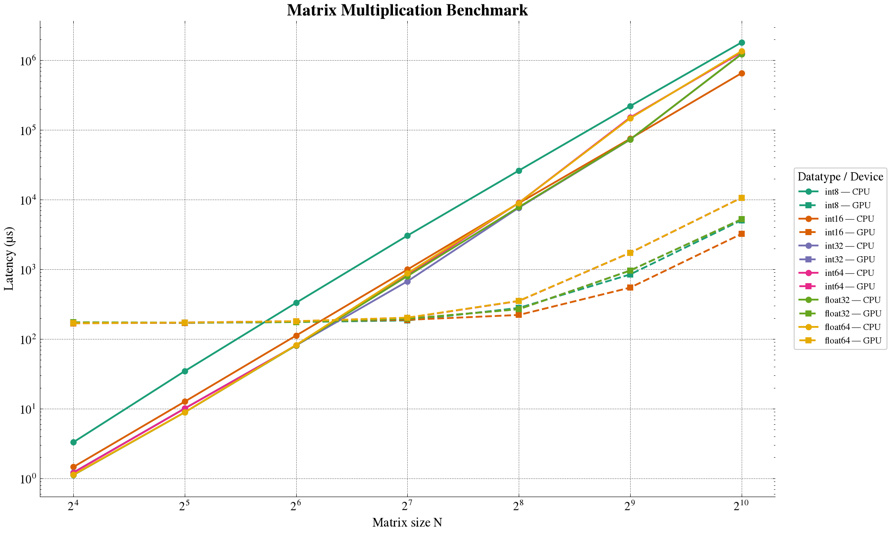
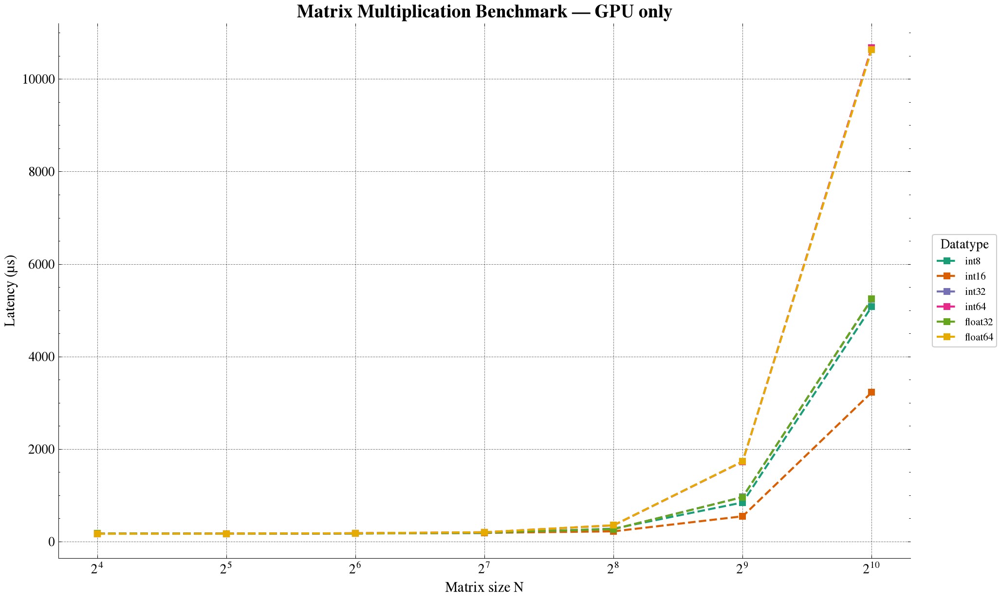

# Matrix Multiplication
C++ and Cuda implementations and optimization experiments.

main proble of matrix Multiplication via naive implementation:
once each thread is assigned a target dst (row, col) it has to perform an accumulation over the
multiplication of matrices `a` and `b`row and col elements (as given by the eqn). This accumultaiton in the gpu basically retrives from global memory `d_a[]` and `d_b[]`elements (in float precision 4 bytes) and writes in the result element `d_dst[]` another number. so two operations `*` and `+` for 8 bytes retrieved and another 4 bytes wrtten after. Really inefficient and bandwith bound for small size matrices.

## Naive implementation
### CPU vs GPU
Naive implementation results averaged across 100 iterations, measuring end-to-end latency. As show in the first image below, we distinguish the two expected regimes:
(1) memory bound and (2) compute bound. (1) For matrix sizes smaller than 128$\times$128 the gpu added overhead (memory allocation via cudaMalloc and memory retrival in parallel by the 
threads when computing the multiplication) dominates and even having thounsand of threads in parallel CPU single threaded implementaiton is still faster.


### GPU only
The following figures show how the end-to-end latency is fixed and stable for matrix sizes up to 256$\times$256 and for all data types. What does this mean? The overhead of preparing the gpu and launching the kernel dominates the execution time, thus having more elements in this regime does not make a difference. It is only for matrices larger than 512$\times$512 where we start to see the exponential growth of the actual arithmetic work (due to having more elements).



Fastest datatypes? `int16` in the compute bound regime and `int8` in the memory-overhead regime (make sense). IN the compute-bound regime, the most interesting, `int16` is followed by `int8`, `float32` and `int32`.
| Size    |     16 |     32 |     64 |    128 |    256 |     512 |    1024 |
| ------- | -----: | -----: | -----: | -----: | -----: | ------: | ------: |
| float32 | 173.97 | 172.19 | 175.61 | 195.93 | 267.76 |  960.47 | 5245.05 |
| float64 | 168.87 | 172.26 | 180.37 | 202.82 | 352.94 | 1734.14 | 10638.4 |
| int16   | **168.59** |    171 | 180.14 | 188.72 | **221.55** |  **546.78** | **3225.88** |
| int32   | 172.55 | 171.31 | 176.08 | 195.88 | 268.35 |  963.03 | 5234.65 |
| int64   | 169.61 | 172.52 | 179.75 | 201.63 | 351.36 | 1730.39 | 10676.1 |
| int8    | 170.25 | **170.51** | **175.26** | **185.01** | 279.51 |  845.56 | 5077.68 |

### GPU only i16, fp16 and bf16


## Tensor Cores and Matrix Multiplication

## Misc.
- **lambda function in c++**
```c++
[captures](parameters) {
    body
}
```
`[&]` allows the lambda function to access variables from the surrounding scope
and use them, only by reference!
# TODO
- [ ] performance for different data types and floating point precisions.
